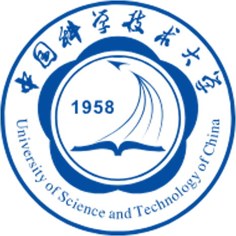



<!-- Education
======
* **Ph.D in Biomedical Engineering** 2022-present  
  [Johns Hopkins University](https://www.jhu.edu/), Baltimore, MD, USA 

* **M.S. in Physics** 2019-2022  
  [University of Science and Technology of China](https://www.ustc.edu.cn/), Hefei, Anhui, China

* **B.S. in Physics** 2015-2019  
University of Science and Technology of China, Hefei, Anhui, China -->

Education
======

  
  

    

      <strong>Ph.D. in Biomedical Engineering</strong>
      2022–present
    

    

      <a href="https://www.jhu.edu/" target="_blank">Johns Hopkins University</a>, Baltimore, MD, USA
    

  

  
  

    

      <strong>M.S. in Physics</strong>
      2019–2022
    

    

      <a href="https://www.ustc.edu.cn/" target="_blank">University of Science and Technology of China</a>, Hefei, Anhui, China
    

  

  
  

    

      <strong>B.S. in Physics</strong>
      2015–2019
    

    

      University of Science and Technology of China, Hefei, Anhui, China
    

  

Professional Experience
======
* **Research Assistant** May 2022-present  
[Advanced Imaging Algorithms and Instrumentation Laboratory](https://aiai.jhu.edu/), Johns Hopkins University, Baltimore, MD, USA 
Supervisor: [Prof. J. Webster Stayman](https://www.bme.jhu.edu/people/faculty/j-webster-stayman/)

* **Research Assistant** Aug 2020-May 2022  
Precision Radiotherapy Laboratory, University of Science and Technology of China, Hefei, Anhui, China  
Supervisor: [Prof. Yidong Yang](https://fusep.ustc.edu.cn/2025/01/06/yidong-yang/)

* **Research Assistant** July 2017-Aug 2020  
Medical Physics Laboratory, University of Science and Technology of China, Hefei, Anhui, China  
Supervisor: [Prof. Lei Zhu](https://cn.linkedin.com/in/lei-zhu-5a06566b)

Review Activities
======
* [IEEE Transactions on Medical Imaging](https://ieeexplore.ieee.org/xpl/RecentIssue.jsp?punumber=42)  
* [IEEE Transactions on Biomedical Engineering](https://ieeexplore.ieee.org/xpl/RecentIssue.jsp?punumber=10)  
* [IEEE Transactions on Nuclear Science](https://ieeexplore.ieee.org/xpl/RecentIssue.jsp?punumber=23)  
* [Medical Physics](https://aapm.onlinelibrary.wiley.com/journal/24734209)  
* [Artificial Intelligence in Medicine](https://www.sciencedirect.com/journal/artificial-intelligence-in-medicine)

Teaching Experience
======
* **Teaching Assistant** Aug 2025-Dec 2025  
Johns Hopkins University, Baltimore, MD, USA  
Course: Physics of Medical Imaging  

* **Teaching Assistant** Aug 2017-June 2021  
University of Science and Technology of China, Hefei, Anhui, China  
Courses: Mechanics, Optics, Atomics, Linear Algebra, Medical Imaging Systems  

  
<!-- Skills
======
* Skill 1
* Skill 2
  * Sub-skill 2.1
  * Sub-skill 2.2
  * Sub-skill 2.3
* Skill 3 -->

<!-- Publications
======
  <ul>
    
  </ul>
  
Talks
======
  <ul>
    
  </ul>
  
Teaching
======
  <ul>
    
  </ul> -->
  
<!-- Service and leadership
======
* Currently signed in to 43 different slack teams -->
